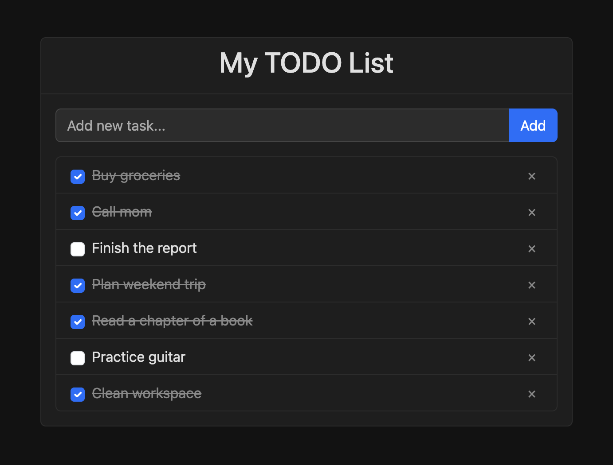

# TODO List Web App

A simple, good-looking TODO list web application built with HTML, Bootstrap, and JavaScript.

This app was entirely implemented using OpenAI Codex with the GPT 4.1 model.



## Features

- Add tasks
- Mark tasks as complete
- Delete tasks
- Persistent storage using `localStorage`
- Fun sound effects 🥳

## Usage

1. Clone the repository:
   ```
   git clone <repository_url>
   ```
2. Open `index.html` in your web browser.

Alternatively, you can serve it via a local HTTP server:
```
# Using Python 3
python3 -m http.server 8000

# Or using Node.js http-server
npx http-server
```

Then navigate to `http://localhost:8000` in your browser.